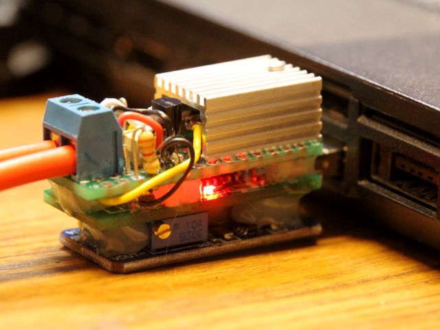

# piTelex
**Control a historic Telex device with a Raspberry Pi (or PC) in Python 3.**

The goal is to connect a historic telex device (teletype) with [TW39 protocol](/wiki/README_P_TW39.md) on a [current loop](/wiki/README_HW_ILoop.md) to a modern Windows/Linux-PC (over USB) and/or a Raspberry Pi (over GPIO) with minimal hardware.

One part of the project is the hardware to adapt the [current loop](/wiki/README_HW_ILoop.md) for TW39 to modern logic level ports.

The other part is the Python software to send and receive the serial data (50 baud, 5 data-bits) and decode the "[Baudot-Murray-Code](/wiki/README_P_BMC.md)" character set (also called "CCITT-2" or "ITA2") to ASCII.

With the characters arrived in the PC/RPi the data can be routed to [i-Telex](https://www.i-telex.net), eMail or IRC. The telex can also be (miss-) used as printer or keyboard.

The software supports also a connection to an other [i-Telex](https://www.i-telex.net) device over internet.

As side effect teletypes with [V.10 inteface](/wiki/README_HW_V10.md) (like TeKaDe FS200) can also be connected to USB-adapter and handled by the software.

> **The software and hardware is still in BETA state. First release is planned in 2019-03**

## Teletype Connection Variations

Typical and tested teletype combinations:

| Computer | Hardware | Protocol | SW-Module | Description |
| :--- | :--- | :--- | :--- | :--- |
| PC-Linux, PC-Windows | CH340 USB-Serial-Adapter TTL + [I-Loop-Electronic](/wiki/README_HW_ILoop.md) | [TW39](/wiki/README_P_TW39.md) | [CH340TTY](/wiki/README_SW_DevCH340TTY.md) | for mechanical teletypes
| RPi | CH340 USB-Serial-Adapter TTL + [I-Loop-Electronic](/wiki/README_HW_ILoop.md) | [TW39](/wiki/README_P_TW39.md) | [CH340TTY](/wiki/README_SW_DevCH340TTY.md) | for mechanical teletypes
| RPi | GPIO on RPi + [I-Loop-Electronic](/wiki/README_HW_ILoop.md) | [TW39](/wiki/README_P_TW39.md) | [RPiTTY](/wiki/README_SW_DevRPiTTY.md) | for mechanical teletypes
| PC-Linux, PC-Windows | CH340 USB-Serial-Adapter V.24 + [V.10-Cable](/wiki/README_HW_V10.md) | V.10 | [CH340TTY](/wiki/README_SW_DevCH340TTY.md) | for TeKaDe FS200 / FS220
| PC-Linux, PC-Windows | USB-Sound-Card + [ED1000-Electronic](/wiki/README_HW_ED1000.md) | [ED1000](/wiki/README_P_ED1000.md) | [ED1000](/wiki/README_SW_DevED1000.md) | for modern electronic teletypes

RPi: Raspberry Pi (Zero W) with Raspian

## Connection from/to Outer Space

| Type | Protocol | SW-Module | Description |
| :--- | :--- | :--- | :--- |
| [i-Telex]( https://www.i-telex.net/) | TCP/IP | [ITelexClient](/wiki/README_SW_DevITelexClient.md) [ITelexSrv](/wiki/README_SW_DevITelexSrv.md) |
| Telnet | TCP/IP | [TelnetSrv](/wiki/README_SW_DevTelnetSrv.md) | raw TCP
| Screen | Keyboard + Monitor | [Screen](/wiki/README_SW_DevScreen.md) | for testing
| IRC | | | planned

---

# Examples

## TW39 Compact USB Interface

 * [Example with TW39 Compact USB Interface](/wiki/README_Example_USB.md)

## TW39 Raspberry Pi Interface

 * [Example with Raspberry Pi](/wiki/README_Example_RPi.md)

## V.10 Interface for TeKaDe FS200Z / FS220Z

* [Example with V.10](/wiki/README_Example_V10.md)

## ED1000 Interface

    IN DEVELOPMENT

---

# Wiki

## Hardware

 * [Electronic for Current-Loop Interface](/wiki/README_HW_ILoop.md)
 * [Electronic for V.10 Interface](/wiki/README_HW_V10.md)
 * [Electronic for ED1000 Interface](/wiki/README_HW_ED1000.md)

## Software

 * [Software](/wiki/README_SW.md)

## Protocol / Coding

 * [Baudot-Murray-Code = CCITT-2 = ITA2](/wiki/README_P_BMC.md)
 * [TW39 / TWM Transmission](/wiki/README_P_TW39.md)
 * [ED1000 Transmission](/wiki/README_P_ED1000.md)

## Additional Information

 * [Additional Information](/wiki/README_A.md)
