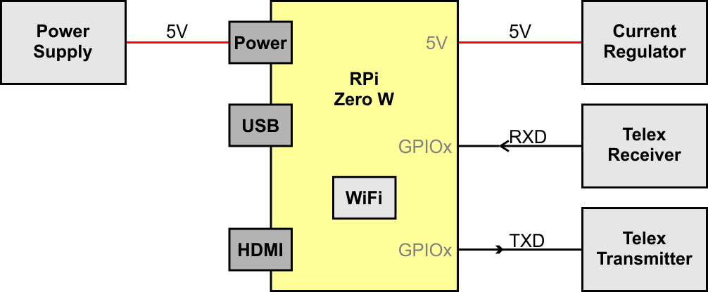
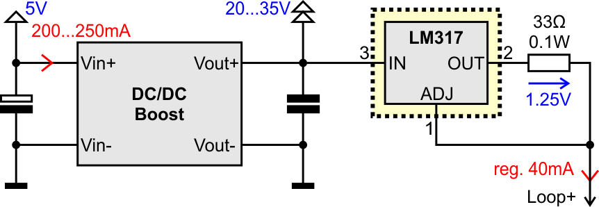
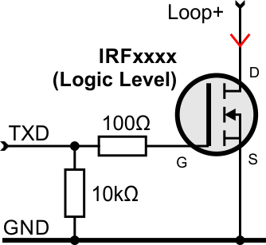

# piTelex
Control a historic Telex device with a Raspberry Pi in Python

The goal is to connect a historic telex device with TW39 current loop to a modern PC (over USB) and/or a Raspberry Pi (over GPIO) with minimal hardware.

One part of the project is the hardware to adapt the current loop "TW39" to modern logic level ports.

The other part is the Python software to send and receive the serial data (50 baud, 5 data-bits) and decode the "CCITT-2" character set (also called "Baudot-Murray-Code" or "ITA2") to ASCII.

With the characters arrived in the PC/RPi the data can be routed to i-Telex, eMail or IRC. The telex can also be (miss-) used as printer or keyboard.

## Electronic for Current-Loop Interface

### Overview of Modules

The Telex adapter hardware have to source a constant (regulated) current of 40mA, switch the current for transmitting data and observe the current for receiving data from the Telex.

The current loop is specified in "TW39".

To use a Telex as an USB-device you can use an USB-to-serial-TTL converter based on a CH340 chip (other chips from FTDI and Prolofic don't work at 50 baud, 5 data-bits, 1.5 stop-bits).

The commutate circuit (drawn in cyan) is optional and only needed when the telex is using a FSG. Without a FSG the cyan area can be removed.

To use router and FSG functionality the adapter hardware can be connected directly to a Raspberry Pi.

### Current Source and Regulator

To simplify the device an adjustable DC/DC boost converter board (from China) is used to get a voltage of 20...30V. The voltage regulator LM317 is used as a fixed current source to get the 40mA. The LM317 works as a linear regulator and must be mounted on a heat sink.

### Telex Transmitter with Bipolar Transistor

To send data to the Telex the current loop has to be switched. A current of 40mA means High, an open loop (no current) means Low. The simplest way is to use a transistor switching to GND.

The transmitter has effectively no voltage drop on the current loop (< 0.2V).

### Telex Transmitter with FET Transistor

Alternatively to a bipolar transistor a logic level FET can be used.

### Telex Receiver

To get data from the Telex the current has to be observed. A current of 40mA means High, an open loop (no current) means Low. For galvanic decoupling an opto-coupler is used.

As opto-coupler a LTV817 or PC817 is recommended. All other coupler with coupling factor > 50% should also work.

The receiver has a voltage drop on the current loop of about 2V.

### Telex Commutate (Option)

To signal the FSG a connection the voltage is pole changed with a relais.

## Electronic for V.10 Interface

Some typewriters have an optional V.10 interface like the TeKaDe FS200Z / FS220Z. The V.10 definition is near to V.24 (RS-232) with a voltage limit of -6...6V.

Most modern UARTs and serial-adapters do not support 50 baud and/or 5 bits. **BUT!** The USB-to-serial-chip CH340 does support it!

In online stores you find an adapter cable USB to RS-232 (not TTL) with a 9-pin Sub-D connector with this CH340 chip (not FTDI or Prolific or CP210x). With this adapter you only have to solder an adapter to connect your typewriter to your PC.

Note: the gray cables are optional and for future features.

## Software

TODO...

### USB-Serial-Adapter

Using an adapter board (or adapter cable - for V.10) based on the chip CH340 the device is detected as normal (virtual) serial interface. In Windows the device is shown as 'COMx'. In Linux it is shown as '/dev/ttyUSBx'.

With the Python library "PySerial" all necessary settings can be done to handle 50 baud, 5 data-bits and 1.5 stop-bits. Also, the handshake pins RTS and DTR can be set by this library.

### Raspberry Pi (RPi)

The build in UART of the RPi can’t handle 50 baud.

The correct timing can be formed jitter-free with the library “PiGPIO”. Receiving can be handled by asynchronous callbacks implemented in this library. With this also a Linux based computer like the RPi can handle precise and reliable timings.

## Additional Information

BC337: 

TIP41: 

