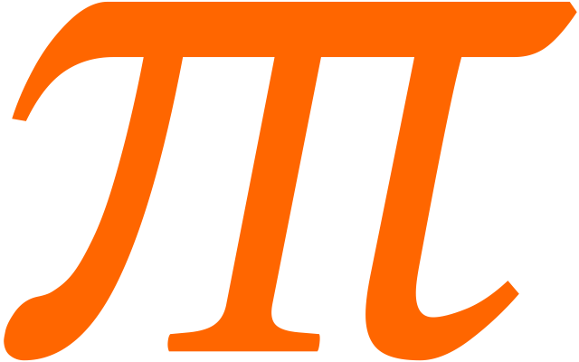

# - piTelex

### Control a historic Telex device with a Raspberry Pi or PC in Python 3

The goal is to connect a historic telex device (teletype) with **TW39** protocol on a **current loop** to a modern **Windows/Linux-PC** (over USB) or a **Raspberry Pi** (over GPIO) with minimal hardware.

Our ambition is also to support all telex features as AT/ST buttons and pulse dialing for handling the teletype like in the good old days.

#### Hardware

One part of the project is the hardware to adapt the **current loop** for **TW39** to modern logic level ports. The 5V or 3.3V TTL lines can be connected directly to an USB-serial-adapter or the GPIO pins of a Raspberry Pi. The current loop is designed as an analog **40mA** current regulator in combination with the switching transistor.

As side effect teletypes with **V.10 interface** (like TeKaDe FS200Z / FS220Z) can also be connected to a USB-to-RS232-adapter with a simple DIY adapter cable. The V.10 interface control lines are completely handled by the software (No FAG200 is needed).

Another playground is the **ED1000 interface** used by (more) modern teletypes (like Siemens T1000, T1200 or SEL Lo2000, Lo3000). It is based on frequency-shift-keying (FSK) and is handled by a USB sound card, a few passive components and a lot of software.

#### Software

The other part is the Python software to send and receive the serial data (50 baud, 5 data-bits) and decode the "**Baudot-Murray-Code**" character set (also called "CCITT-2" or "ITA2") to ASCII.

With the characters arrived in the PC / RPi the data can be routed to an internet services like [i-Telex](https://www.i-telex.net), Telnet, eMail, RSS or IRC. The teletype can also be (miss-) used as a steampunk printer or keyboard.

The software supports also a connection to another telex device in the **[i-Telex Network](https://www.i-telex.net)** over TCP/IP.

#### Documentation

For building the hardware and implementing the software it was important to understand the protocols and timings. So, another objective was to pick up the pieces of information a bring it into an understandable form.

**[For more information see the WIKI pages](https://github.com/fablab-wue/piTelex/wiki)**

<!--

##### Project Status

The software and hardware are in use by about 10 teletype stations and working fine.

##### Last changes

- 2020-09: Moved non-source-code folders to new project [piTelex.supplement](https://github.com/fablab-wue/piTelex.supplement)
- 2020-09: Merged Björns rework of i-Telex protocol handling and ED1000 workflow
- 2020-08: Merged Björns fork (https://github.com/b-schliessmann/piTelex) with TNS, ED1000 and i-Telex-connection rework
- 2020-08: Added device module CLI for commands over teletype
- 2020-07: Merged Dirks device module for Twitter (https://github.com/dirkenstein/piTelex)
-->