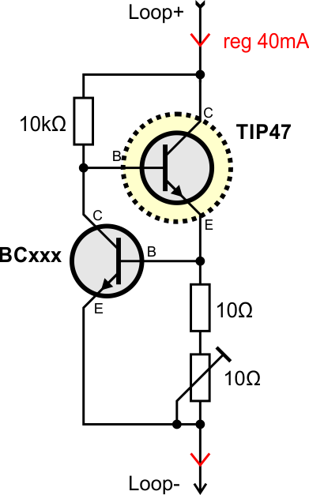

# Electronic for Current-Loop Interface

## Overview of Modules

The Telex adapter hardware have to source a constant (regulated) current of 40mA, switch the current for transmitting data and observe the current for receiving data from the Telex.

The current loop is specified in "TW39".

To use a Telex as an USB-device you can use an USB-to-serial-TTL converter based on a CH340 chip (other chips from FTDI and Prolofic don't work at 50 baud, 5 data-bits, 1.5 stop-bits).

The commutate circuit (drawn in cyan) is optional and only needed when the telex is using a FSG. Without a FSG the cyan area can be removed.

To use router and FSG functionality the adapter hardware can be connected directly to a Raspberry Pi.

## Current Source and Regulator

To simplify the device an adjustable DC/DC boost converter board (from China) is used to get a voltage of 20...35V. The voltage regulator LM317 is used as a fixed current source to get the 40mA. The LM317 works as a linear regulator and must be mounted on a heat sink.

## Alternative Regulator

With 2 Transistors a current regulatir is implemented with a voltage tolerance of 120 volt. The TIP47 works as a linear regulator and must be mounted on a heat sink.

## Telex Transmitter with Bipolar Transistor

To send data to the Telex the current loop has to be switched. A current of 40mA means High, an open loop (no current) means Low. The simplest way is to use a transistor switching to GND.

The transmitter has effectively no voltage drop on the current loop (< 0.2V).

## Telex Transmitter with FET Transistor

Alternatively to a bipolar transistor a logic level FET can be used.

## Telex Receiver

To get data from the Telex the current has to be observed. A current of 40mA means High, an open loop (no current) means Low. For galvanic decoupling an opto-coupler is used.

As opto-coupler a LTV817 or PC817 is recommended. All other coupler with coupling factor > 50% should also work.

The receiver has a voltage drop on the current loop of about 2V.

## Telex Commutate (Option)

To signal the FSG a connection the voltage is pole changed with a relais.

# Complete Examples

## Compact USB Interface

This is the first approach with a USB to TTL adapter (middle), a DC/DC converter (bottom) and a self-made-board (top) for current regulator, reading and contolling the loop.

This can be used with a Windows-PC, Linux-PC, Mac (not tested) and RPi.

## TW39 High Voltage RPi Interface

The PCBs are ordered and will be assembled and tested in Feb. 2019

Design files can be found in project folder /PCB/

This is designed for Raspberry Pi but with a CH340-serial-adapter this can be also used with a Windows-PC, Linux-PC, and Mac (not tested).

# Power supply

Alle teletypes (with current loop interface) are designed for a current of 40mA. The receive unit (magnet coil) has a typical voltage drop of 15V. With the voltage drops in the interface circuits a power supply voltage of about 20V should do - in theory.

**BUT!** The switching speed of a magnet coil depends directly on intermediate circuit voltage - in this case the power supply voltage. On practical experience a intermediate circuit voltage should be at least 2x of the magnet coil voltage.

**ADDITIONAL BUT!** Most teletypes are used with a FSG (dialing device). This has als relais in the current loop with an additional voltage drop. Some relais circuits (especially for "Wahlbereitschaft" = ready for dial) needs a very voltage for work as expected.

### Hands-on tests

Working supply voltages with interfaces above:

Lo15, T37, T68 without FSG: 24V

T100S with integrated FSG: 60V

**TODO** more details...