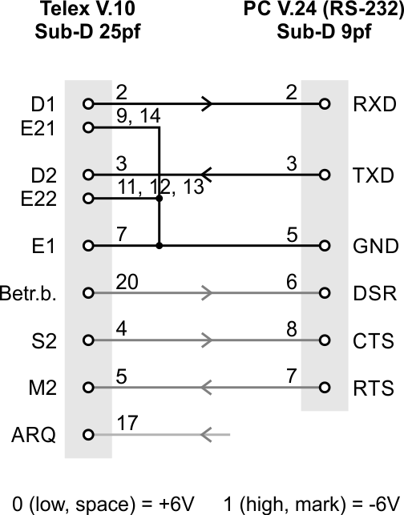

# Electronic for V.10 Interface

Some typewriters have an optional V.10 interface like the TeKaDe FS200Z / FS220Z. The V.10 definition is near to V.24 (RS-232) with a voltage limit of -6...6V.

Most modern UARTs and serial-adapters do not support 50 baud and/or 5 bits. **BUT!** The USB-to-serial-chip CH340 does support it!

In online stores you find an adapter cable USB to RS-232 (not TTL) with a 9-pin Sub-D connector with this CH340 chip (not FTDI or Prolific or CP210x). With this adapter you only have to solder an adapter to connect your typewriter to your PC.

Note: the gray cables are optional and for future features.

If Telex is powered up, the "Beriebsbereit" is set to 5V.
S2 is set to 5V if LIN-button is pressed and line communication is active.
A rising edge (to 5V) on M2 make a beep sound.

