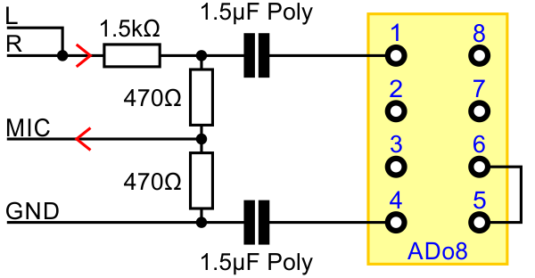

# ED1000

> FOR FUTURE PLUGINS - NOT IMPLEMENTED YET

ED1000 is a technique to connect a teletype to a central office with 2 wires. A Frequency-Shift-Keying (FSK) is used to send and receive simultaniously. It is like a MODEM (V.21) but with different carrier frequencies.

## SEU-A/B Standard

### Definitions

| Type | Definition |
| --- | --- |
| A | Central Office, Switching Exchange, EDS, (PC Sound Card)
| B | Terminal Station, Teletype

Type 'B' is the normal configuration for a teletype. Some teletypes can be configured as type 'A' to be connected directly to another teletype.

### Levels and Frequencys

| SEU | Direction | Frq A (space, 0) | Frq Z (mark, 1) | Level | U rms * | U p * |
| --- | --- | ---: | ---: | ---: | ---: | ---: |
| A | Send | 500Hz | 700Hz | -14.5dBm | 0.146V | 0.206V
| A | Receive | 2250Hz | 3150Hz | &ge;-34.0dBm | &ge;0.015V | &ge;0.022V
| B | Send | 2250Hz | 3150Hz | -9.0dBm | 0.275V | 0.389V
| B | Receive | 500Hz | 700Hz | &ge;-28.5dBm | &ge;0.029V | &ge;0.041V

*: at termination of 600Ohm

Seeing the lower frequencies as a bit value '0' and the higher as '1', the bit values can be used as from a TTL async. serial adapter.

### Max. Line Length

| Distance | Conductor Diameter |
| ---: | ---: |
| 20km | 0.8mm
| 14km | 0.6mm
| 10km | 0.4mm

### Max. Line Loss

| Direction |  Frequency Band | Loss |
| --- | ---: | ---: |
| A &rarr; B | 600Hz &pm; 100Hz | 14dB
| B &rarr; A | 2700Hz &pm; 450Hz | 25dB

## Hardware

### ADo8 Plug

| Pin |  Description |
| ---: | --- | --- |
| 1 | Line a
| 2 | nc
| 3 | nc
| 4 | Line b
| 5 | Bridge to 6
| 6 | Bridge to 5
| 7 | nc / Paper-End-Switch
| 8 | nc / Paper-End-Switch

The line wires are used to send **and** receive at the same time like a MODEM on phone wires.

The bridge between pin 5 and 6 is for signaling a connected plug. May be high voltages can be used by teletype!

Some teletypes use a switch (relay) on pin 7 and 8 to signal paper end.

### Connecting a PC Sound Card to ADo8

## Software

> In development:

### Using IIR-Filter

 * Slice samples in 5ms pieces
 * Filter each slice for 2250HZ and 3150Hz:

        filter_bp = signal.iirfilter(4, [f/1.05, f*1.05], rs=40, btype='band',
                    analog=False, ftype='butter', fs=sample_f, output='sos')

 * Get average of abs() per slice per frequency
 * Compare values of both frequencies to get bit value (0/1)

 ### Using FFT...

 ...
