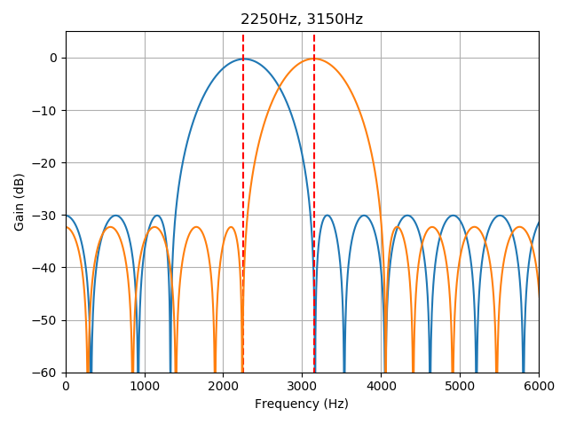

# ED1000

FOR FUTURE PLUGINS - NOT IMPLEMENTED

### SEU-A/B

| SEU | Direction | F_A (0) | F_Z (1) | Level | U rms | U p |
| --- | --- | --- | --- | --- | --- | --- |
| A | Send | 500Hz | 700Hz | -14.5dBm | 0.146V | 0.206V
| A | Receive | 2250Hz | 3150Hz | &ge;-34dBm | 0.015V | 0.022V
| B | Send | 2250Hz | 3150Hz | -9dBm | 0.275V | 0.389V
| B | Receive | 500Hz | 700Hz | &ge;-28.5dBm | 0.029V | 0.041V

Termination = 600Ohm

A = Office = EDS
B = Terminal Station

20km @ 0.8mm conductor diameter
14km @ 0.6mm conductor diameter
10km @ 0.4mm conductor diameter

Tolerable Line Loss:
A -> B (600Hz) 14dB
B -> A (2700Hz) 25dB

ADo8-Plug
1 a line
4 c line
5-6 Bridge (for signaling a connected plug)

### Software

fbw = (recv_f[1] - recv_f[0]) * 0.95

filter_bp = signal.remez(80, [0, f-fbw, f, f, f+fbw, sample_f/2], [0,1,0], fs=sample_f)
