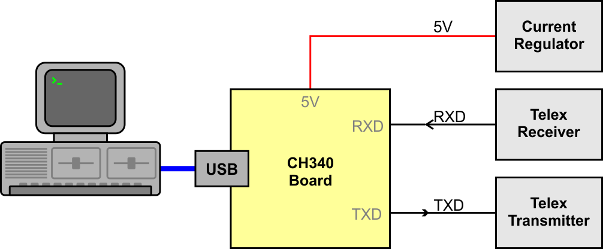
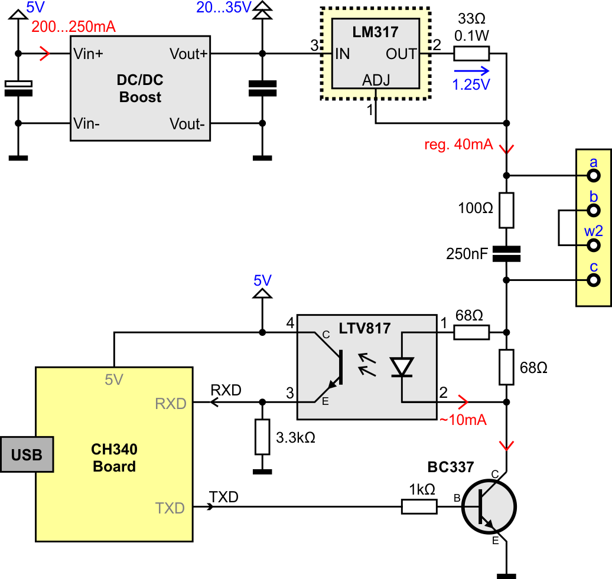

# Example with TW39 Compact USB Interface
TODO...

## Hardware

This is the first approach with a USB to TTL adapter (middle), a DC/DC converter (bottom) and a self-made-board (top) for current regulator, reading and controlling the loop.

### Schematics

This can be used with a Windows-PC, Linux-PC, Mac (not tested) and Raspberry Pi.

Note: Connect pin RXD with pin CTS on the CH340-board.

---

## Software

For Installation see [SW_Install](SW_Install.md)

This electronic is handles by the software module [CH340TTY](SW_DevCH340TTY.md).

Start the program with arguments -Y TTY and -m TW39 on Linux:
    
    telex -Y /dev/ttyUSB0 -m TW39 -I 2342

or on Windows
    
    telex -Y COM3 -m TW39 -I 2342

Note: The argument -I is to start the i-Telex [client](SW_DevITelexClient.md) and [server](SW_DevITelexSrv.md) at port 2342.

## ???

TODO