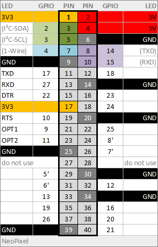

# Example with Raspberry Pi
TODO...

## Hardware for TW39 High Voltage

The PCBs are ordered and will be assembled and tested in Feb. 2019

Design files can be found in project folder /PCB/

### RPi Pinout

Note: For pulse dial in I-loop connect pin 13 (RXD) with pin 31 (DIAL_SW) and configure GPIO 6 for 'pin_fsg_ns' in software.

---

## Software

For Installation see [SW_Install](/wiki/README_SW_Install.md)

This electronic is handles by the software module [RPiTTY](/wiki/README_SW_DevRPiTTY.md).

Start the program with arguments -G and -m TW39 on RPi:
    
    telex -G -I 2342

Note: The argument -I is to start the i-Telex [client](/wiki/README_SW_DevITelexClient.md) and [server](/wiki/README_SW_DevITelexSrv.md) at port 2342.

## ???

TODO