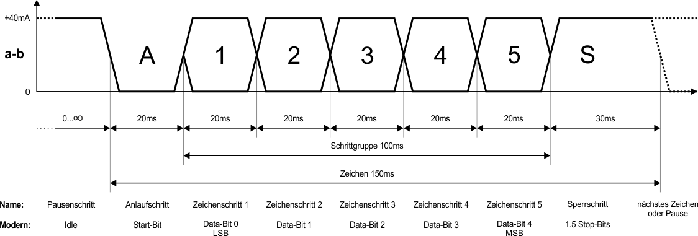
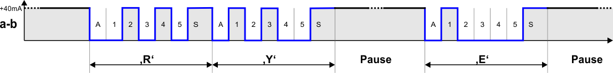

# Baudot-Murray-Code = CCITT-2 = ITA2

| 543.21 | LTRS | FIGS | ASCII |
| --- | --- | --- | --- |
| 000.00 |    undef | undef | '~'
| 000.01 |    E     | 3
| 000.10 |    ZL    | ZL | '\|' &lt;LF&gt;
| 000.11 |    A     | -
| 001.00 |    SPACE | SPACE | ' '
| 001.01 |    S     | '
| 001.10 |    I     | 8
| 001.11 |    U     | 7
| 010.00 |    WR    | WR | '&lt;' &lt;CR&gt;
| 010.01 |    D     | WRU | '@'
| 010.10 |    R     | 4
| 010.11 |    J     | BELL | '%'
| 011.00 |    N     | ,
| 011.01 |    F     | undef
| 011.10 |    C     | :
| 011.11 |    K     | (
| 100.00 |    T     | 5
| 100.01 |    Z     | +
| 100.10 |    L     | )
| 100.11 |    W     | 2
| 101.00 |    H     | undef
| 101.01 |    Y     | 6
| 101.10 |    P     | 0
| 101.11 |    Q     | 1
| 110.00 |    O     | 9
| 110.01 |    B     | ?
| 110.10 |    G     | undef
| 110.11 |    FIGS Zi | FIGS Zi | ']'
| 111.00 |    M     | .
| 111.01 |    X     | /
| 111.10 |    V     | =
| 111.11 |    LTRS Bu | LTRS Bu | '['

---

## Timing

Example:

