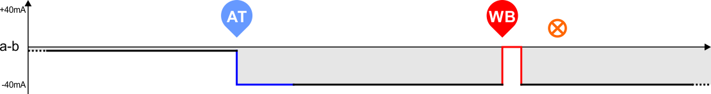
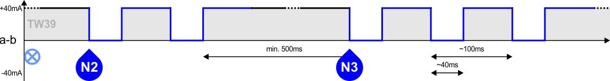
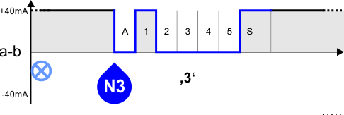
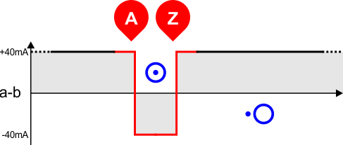
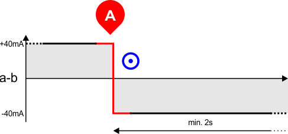
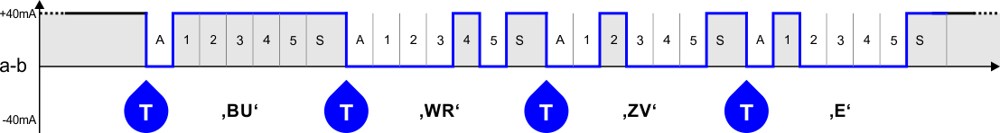
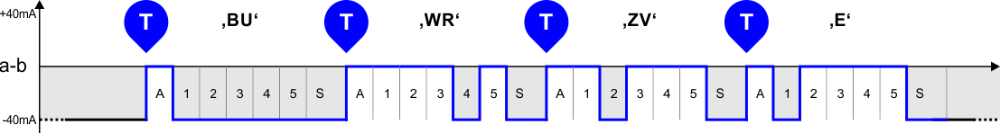
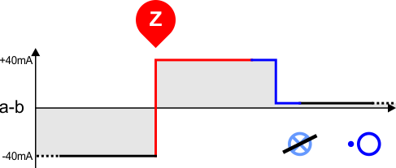
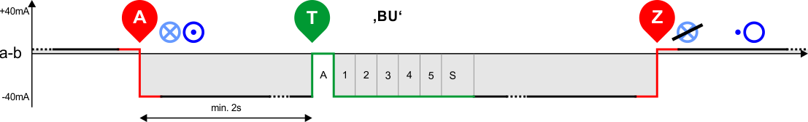
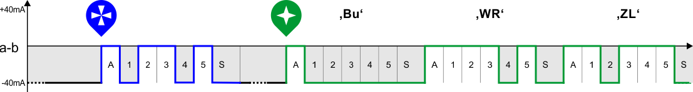

# TW39 / TWM

## Outgoing Call

Idle mode ... +5...7mA ...

### Begin Call

Pressing button AT on FSG...

### Dialing

Dialing with number switch...

TWM: Dialing with keyboard...

### Connecting

On fail...

On success...

### Transmitting Content

Typing characters...

Transmitting without pause...

### Ending Call

User is pressing button ST...

Ending by office...

---

## Incoming Call

---

## WRU (Wer da?)

