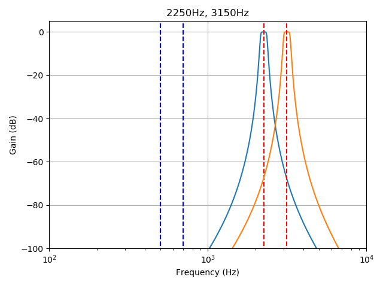

# Device Module "DevED1000"

TODO...

## Module Information

### System

| System | Comments |
| --- | --- |
| RPi | unknown
| PC Linux | unknown
| PC Windows | BETA working
| Mac | unknown

### Dependencies

| Python Module | Install | Anaconda |
| --- | --- | --- |
| pyaudio | pip install pyaudio | conda install pyaudio
| numpy | ? | -included-
| scypy | ? | -included-

### Command Line Arguments

    -E
    --ED1000

### Config File Parameter

| Param | Default | Description |
| :--- | --- | :--- |
| devindex | None |
| baudrate | 50 |
| send_f0 | 500 |
| send_f1 | 700 |
| recv_f0 | 2250 |
| recv_f1 | 3150 |
| zcarrier | False |

## Description

TODO

## Implementation

TODO

> In development:

### Using IIR-Filter

 * Slice samples in 5ms pieces
 * Filter each slice for 2250HZ and 3150Hz:

       filter_bp = signal.iirfilter(4, [f/1.05, f*1.05], rs=40, btype='band',
                    analog=False, ftype='butter', fs=sample_f, output='sos')

 * Get average of abs() per slice per frequency
 * Compare values of both frequencies to get bit value (0/1)

 ### Using FFT...

TODO...

 ...
